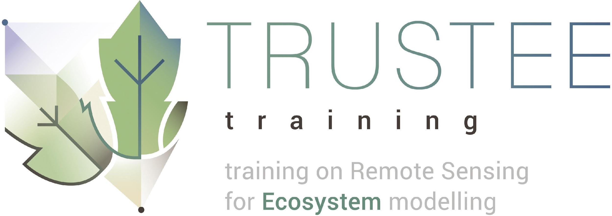

# ecofunr

A framework to derive **Eco**system **Fun**ctional Properties including Physio-Phenological events using [FLUXNET](https://fluxnet.fluxdata.org/) database.

## Installation

You can install the released version of ecofunr from [github](https://github.com/dpabon/ecofunr) with:

``` r
devtools::install_github("dpabon/ecofunr")
```

## Loading

```r
library(ecofunr)
```

## Acknowledgments


This package has been developed in the [Deparment of Biogeochemical Integration](https://www.bgc-jena.mpg.de/bgi/index.php/Main/HomePage) of the Max-Planck Institute for Biogeochemisty.


 This package has been developed in the context of the TRUSTEE project (http://www.trusteenetwork.eu/).

 This project has received funding from the European Union’s Horizon 2020 research and innovation
programme under the Marie Skłodowska-Curie grant agreement No 721995.
